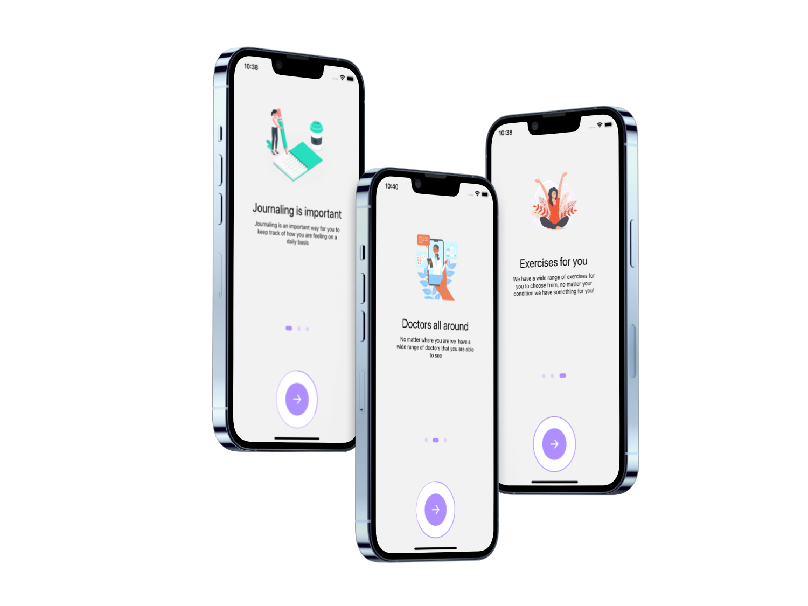
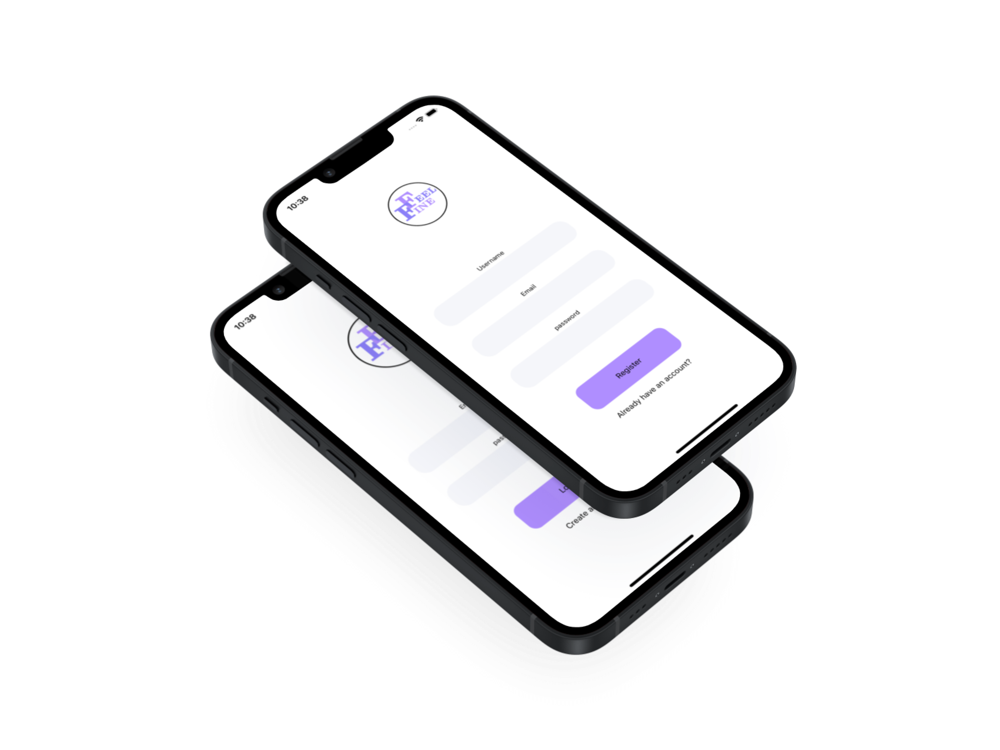
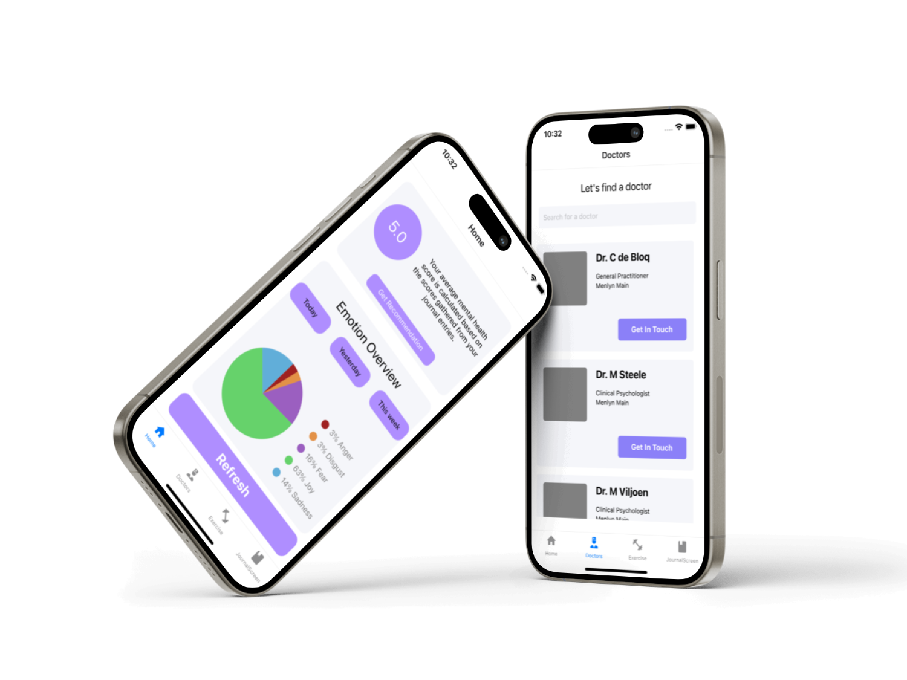
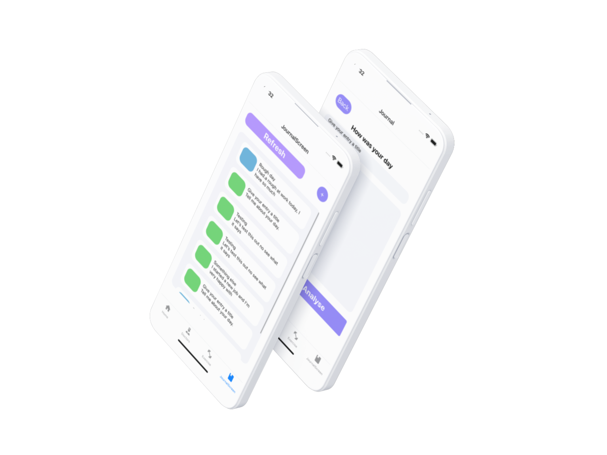

# FeelFine
 FeelFine is a mobile mental health application with integrated AI services to complete sentiment analyses on your daily entries, we also have a wide range of doctors and exercises to make you feel the best you can.


 

<!-- Repository Information & Links-->
<br />


<!-- HEADER SECTION -->
<h5 align="center" style="padding:0;margin:0;">Justin Koster</h5>
<h5 align="center" style="padding:0;margin:0;">200100</h5>
<h6 align="center">DV300 | Term 4</h6>
</br>
<p align="center">

  <a >
    
  </a>
  
  <h3 align="center">Feel Fine</h3>

  <p align="center">
    A mental health application that makes use of IBM Watson Natural Language Understanding model to do emotion recognition on journal entrys.<br>
    
   <br />
   <br />
   <!-- <a href="https://drive.google.com/file/d/1j6DtiOVNjZtj-PM3QdH7revrMJuhhsdm/view?usp=sharing">View Demo</a> -->
    ·
    <a href="https://github.com/RetroPixelz/FeelFine/issues">Report Bug</a>
    ·
    <a href="https://github.com/RetroPixelz/FeelFine/issues">Request Feature</a>
</p>
<!-- TABLE OF CONTENTS -->

## Table of Contents

- [About the Project](#about-the-project)
  - [Project Description](#project-description)
  - [Built With](#built-with)
- [Getting Started](#getting-started)
  - [Prerequisites](#prerequisites)
  - [How to install](#how-to-install)
- [Features and Functionality](#features-and-functionality)
- [Concept Process](#concept-process)
  - [Ideation](#ideation)
  - [Wireframes](#wireframes)
- [Development Process](#development-process)
  - [Implementation Process](#implementation-process)
    - [Highlights](#highlights)
    - [Challenges](#challenges)
  - [Future Implementation](#peer-reviews)
- [Final Outcome](#final-outcome)
  - [Mockups](#mockups)
  - [Video Demonstration](#video-demonstration)
- [Conclusion](#conclusion)
- [License](#license)
- [Contact](#contact)
- [Acknowledgements](#acknowledgements)

<!--PROJECT DESCRIPTION-->

## About the Project

<!-- header image of project -->

<!--  -->


### Project Description

Welcome to FeelFine! This is a React-native mobile application that makes use of IBM Watson Natural Languange Understanding model to do emotion recognition on journal entries.
### Built With
React-Native, Firebase & IBM Wattson NLU


<!-- GETTING STARTED -->
<!-- Make sure to add appropriate information about what prerequesite technologies the user would need and also the steps to install your project on their own mashines -->

## Getting Started

The following instructions will get you a copy of the project up and running on your local machine for development and testing purposes.

### Installation

Here are a couple of ways to clone this repo:

1.  GitHub Desktop </br>
    Enter `https://github.com/RetroPixelz/FeelFine.git` into the URL field and press the `Clone` button.

2.  Clone Repository </br>
    Run the following in the command-line to clone the project:

    ```sh
    git clone https://github.com/RetroPixelz/FeelFine.git
    ```

        Open `Software` and select `File | Open...` from the menu. Select cloned directory and press `Open` button

3.  Install Dependencies </br>
    Run the following in the command-line to install all the required dependencies:

    ```sh
    npm install
    ```
4.  Create an IBM Watson cloud account </br>
    Go to the official IBM watson website and create an API key for the Natural Language Understanding.

    in the services foleder, navigate to the `analyzeEmotions.js` file and inlcude your API key there.

5.  Run Application </br>
    Run the following in the command-line to run the application:

    ```sh
    expo start
    ```


<!-- FEATURES AND FUNCTIONALITY-->
<!-- You can add the links to all of your imagery at the bottom of the file as references -->

## Features and Functionality

<!-- note how you can use your gitHub link. Just make a path to your assets folder -->

### Login & Signup


Login and Registration functionality with Firebase for the user to create or login with an account.

### landing screen


The landing or dashboard screen is the first screen the user sees, here the user can see an overview of all their emotions throughout all of their journal entrys aswell as an average mental health score based on the average scores gathered from each entry.

### Journal


Here the user can see a list of all their journal entrys, that are colour coordinated based on the score of the highest ranking emotion, users can also create new journal entrys where the AI tool will perform the emotion recognition and save it with the entry in the users DB collection.

## Concept Process

We had an open brief, so i was allowed to create a mobile or web application, once i came across the idea to make a mental health application it was only fitting to create it as a mobile app for ease of use.

<!-- ### Mood Board


### Wireframes

 -->


## Development Process

I made a React Native application, after creating the frontend layout I gained access to the AI API key and set out to create the functionality for this.

### Implementation Process

- React-Native was the framework for this application.
- I made use of EXPO to run this application on a simulator for testing purposes.
- IMB Wattson Natural Language Understanding model was used to perform the AI functionality.
- I made use of React-Native-Chart-Kit to visualise the data for the entries.
- I made use of Firebase to store all the data related to my user.


#### Highlights

<!-- stipulated the highlight you experienced with the project -->

- A huge highlight for me was to make use of the AI tool to incorporate the functionality of my application.
- Gained alot more understanding of react native and the life cycle of mobile applictaions.
- Made a much cleaner and sleek UI design compared to other projects, i was very pleased with the outcome of the visual design.

#### Challenges

<!-- stipulated the challenges you faced with the project and why you think you faced it or how you think you'll solve it (if not solved) -->

- Navigation and function calling was a big challenge, i had so much different data and filtering in this application I lost myself in the files a few times.
- Finding the right AI tool to work with the application, normal sentiment analysis give responses ranging for negative to possitive, but i needed something that can identify individual emotions.


### Future Implementation

<!-- TODO Change this! -->

<!-- stipulate functionality and improvements that can be implemented in the future. -->

- Make the data loading very smooth without the need for refreshing buttons.
- Imoprove average score function calculation to be more accurate.
- Add JWT, more validation.


<!-- MOCKUPS -->

## Final Outcome

### Mockups

<!-- TODO Change this -->

<!-- 


 -->


<br>


## Authors

- **Justin Koster** - [Github](https://github.com/RetroPixelz)

<!-- LICENSE -->

## License

Distributed under the MIT License. See `LICENSE` for more information.\

<!-- LICENSE -->

## Contact

- **Justin Koster** - [200100@virtualwindow.co.za](200100@virtualwindow.co.za) 
- **Project Link** - https://github.com/RetroPixelz/WowCraft

<!-- ACKNOWLEDGEMENTS -->

## Acknowledgements

<!-- all resources that you used and Acknowledgements here -->
<!-- TODO Change this -->

- [Stack Overflow](https://stackoverflow.com/)
- [Figma](https://www.figma.com/)
- [IBM Watson](https://cloud.ibm.com/developer/watson/dashboard)


Footer
© 2023 GitHub, Inc.
Footer navigation
Terms
Privacy
Security
Status
Docs
Contact GitHub
Pricing
API
Training
Blog
About
rust-stash/README.md at main · Justin-OwiStudent/WowCraft